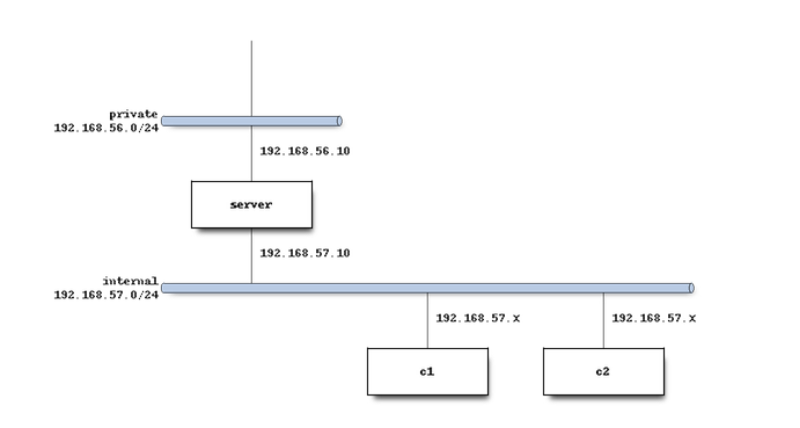

# Practice 2 -- Do the practice DHCP Server Configuration with Ansible

In this new practice we will repeat the last practice but using Ansible to do the provisions.



------------------------------------------------------------------------

**Author:**\
Daniel Sánchez Cabello

**Course/Subject:** 2º ASIR B -- Network Services and Internet\
**Finish date:** 19/10/2025

------------------------------------------------------------------------

## Index

1.  [Vagrantfile Creation and VM's Network Configuration](#1-vagrantfile-creation-and-vms-network-configuration)
    1.  [Server Creation](#11-server-creation)
    2.  [Client 1 Creation](#12-client-1-creation)
    3.  [Client 2 Creation](#13-client-2-creation)
    4.  [Vagrantfile final result](#14-vagrantfile-final-result)

2.  [Ansible files configuration](#2-ansible-files-configuration)
    1.  [Creating Ansible configuration file](#21-creating-ansible-configuration-file)
    2.  [Creating the inventory](#22-creating-the-inventory)
    3.  [Creating the playbook](#23-creating-the-playbook)

3.  [Verification](#3-verification)
    1.  [Deploy of the playbook](#31-deploy-of-the-playbook)
    2.  [Verifying addresses](#32-verifying-addresses)


------------------------------------------------------------------------

## 1. Vagrantfile Creation and VM's Network Configuration

### 1.1 Server Creation

The first step is to tell Vagrant the box that we will use, in this case
`debian/bullseye64`.

Then we create the first VM called **server** and configure two network
interfaces:

-   **Private network** -- `192.168.56.10` → to get a host-only
    communication with our real computer.\
-   **Internal network** -- `192.168.57.10` → to communicate with the
    two clients that will be isolated from our computer.

After that, we must add the provision path. In that provision we will
set further configurations.

------------------------------------------------------------------------

### 1.2 Client 1 Creation

Now, let's create the first client called **c1**.\
This one will receive the IP from the server given a range of IPs
(`192.168.57.25 – 192.168.57.50`).\
That means that inside that range, it can receive any IP that is free
from the server.

We must also configure the network as an internal network and specify
that it will receive the IP through DHCP.\
Also, set the path for the provision file.

------------------------------------------------------------------------

### 1.3 Client 2 Creation

For the other client (**c2**), the process will be the same except for a
detail:\
the IP address it receives will be **fixed by MAC**, which means that we
will indicate its MAC address and the server will always give the same
IP to that MAC.

Add the path for the provision too (it is the same for c1 and c2).

------------------------------------------------------------------------

### 1.4 Vagrantfile final result

Now, lets create the whole vagrantfile. Wecan add the provision with ansible to the vagrantfile directly so it will be used when we set up th machines with `vagrant up` or we can provision the machines later (when they are running) using the command `ansible-playbook [-i inventoryname.yml] [playbookname.yml]`. If we already have the default playbook in the configuration file, it is not necessary to write it in the previous command, do this instead: `ansible-playbook [playbookname.yml]`

<details><summary>Vagrantfile with provision</summary>

```ruby

# -*- mode: ruby -*-
# vi: set ft=ruby :
Vagrant.configure("2") do |config|
  config.vm.box = "debian/bullseye64"

    #Creación servidor 
    config.vm.define "server" do |server|
    server.vm.hostname = "server"
    #Adaptador 1: Red privada
    server.vm.network "private_network", 
                      ip: "192.168.56.10"
    #Adaptador 2: Red interna (DHCP)
    server.vm.network "private_network", 
                      ip: "192.168.57.10", 
                      virtualbox__intnet: "intNet1",
                      auto_config: true
    #Provision con ansible
    server.vm.provision "ansible" do |ansible|
      ansible.playbook = "playbook.yml"
      ansible.inventory_path = "inventory.yml"
    end
  end


  #Cliente 1
  config.vm.define "c1" do |c1|
    c1.vm.hostname = "c1"
    c1.vm.network "private_network",
                  virtualbox__intnet: "intNet1",
                  type: "dhcp"
    c1.vm.provision "ansible" do |ansible|
      ansible.playbook = "playbook.yml"
      ansible.inventory_path = "inventory.yml"
    end
  end

  #Cliente 2
  config.vm.define "c2" do |c2|
    c2.vm.hostname = "c2"
    c2.vm.network "private_network",
                  mac: "080027AABBCC",
                  virtualbox__intnet: "intNet1",
                  type: "dhcp"
    c2.vm.provision "ansible" do |ansible|
      ansible.playbook = "playbook.yml"
      ansible.inventory_path = "inventory.yml"
    end
  end
end

```
</details>

## 2. Ansible files configuration

This time we will do the provision using Ansible wich is a tool that allow us to provision in a more sofisticated and professional way. Instead of using scripts, we can make an inventory of machines adn run a playbook with tasks against the items of that inventory.

------------------------------------------------------------------------

### 2.1 Creating Ansible configuration file 

Here we must include the general configuration for Ansible. For example we can set the path for the inventory that will be used for all the playbooks, so the we do not need to specificate. If we had different inventories, then we should not include any of the here. Also we can set the remote user and other parameters.

File: `ansible.cfg`

``` ini
  [defaults]
  inventory = ./inventory.yml
  remote_user = vagrant
  host_key_checking = False
  interpreter_python = auto_silent
  deprecation_warnings=False

```

------------------------------------------------------------------------

### 2.2 Creating the inventory

The inventory is used to have an organized list of the machines we will have and their general connection details, such as the IP, port, or key. We could have used Vagrant’s generic key for all the machines and included it under the vars section, where general parameters are set, but in this case, I assigned each machine the path to the key stored in its own files.

File: `inventory.yml`

``` yml
  all:
    vars:
      ansible_user: vagrant
      ansible_python_interpreter: /usr/bin/python3

    children:
      servers:
        hosts:
          server:
            ansible_host: 127.0.0.1
            ansible_port: 2222
            ansible_private_key_file: .vagrant/machines/server/virtualbox/private_key

      clients:
        hosts:
          c1:
            ansible_host: 127.0.0.1
            ansible_port: 2200
            ansible_private_key_file: .vagrant/machines/c1/virtualbox/private_key
          c2:
            ansible_host: 127.0.0.1
            ansible_port: 2201
            ansible_private_key_file: .vagrant/machines/c2/virtualbox/private_key
```

------------------------------------------------------------------------

### 2.3 Creating the playbook

First, connect via SSH to the three VMs and use `ip a` to chech the network adapter used for communication and the use the command `vagrant ssh-config` para ver los puertos de cada máquina. Esto es muy importante a la hora de crear el playbook.

We will do a series of tasks to install the dhcp tools, set the subnets configuration and check that everything is alright. The first group of tasks will be run on the server and the second in the clients. Here in the playbook, we run the tasks aiming the groups created on the inventory.

File: `playbook.yml`

```yml

---
- name: Configure DHCP Server
  hosts: server
  become: true
  tasks:
    - name: Update apt cache
      ansible.builtin.apt:
        update_cache: true

    - name: Install DHCP server tools
      ansible.builtin.apt:
        name:
          - isc-dhcp-server
          - net-tools
          - iproute2
        state: present

    - name: Configure DHCP server interface
      ansible.builtin.lineinfile:
        path: /etc/default/isc-dhcp-server
        regexp: "^INTERFACESv4="
        line: 'INTERFACESv4="eth2"'

    - name: Deploy DHCP configuration
      ansible.builtin.copy:
        dest: /etc/dhcp/dhcpd.conf
        owner: root
        group: root
        mode: "0600" 
        content: |
          default-lease-time 86400;
          max-lease-time 691200;
          authoritative;

          subnet 192.168.57.0 netmask 255.255.255.0 {
            range 192.168.57.25 192.168.57.50;
            option routers 192.168.57.10;
            option broadcast-address 192.168.57.255;
            option domain-name-servers 8.8.8.8, 4.4.4.4;
            option domain-name "micasa.es";
          }

          host c2 {
            hardware ethernet 08:00:27:aa:bb:cc;
            fixed-address 192.168.57.4;
            option domain-name-servers 1.1.1.1;
            default-lease-time 3600;
          }

    - name: Restart DHCP server
      ansible.builtin.service:
        name: isc-dhcp-server
        state: restarted
        enabled: true

- name: Configure DHCP Clients
  hosts: clients
  become: true
  tasks:
    - name: Update apt cache
      ansible.builtin.apt:
        update_cache: true

    - name: Install DHCP client tools
      ansible.builtin.apt:
        name:
          - net-tools
          - iproute2
          - isc-dhcp-client
        state: present

    - name: Request DHCP lease
      ansible.builtin.command: dhclient -v
      register: dhclient_result
      changed_when: false
      failed_when: false

    - name: Show IP addresses
      ansible.builtin.command: ip a
      register: ip_result
      changed_when: false
      failed_when: false

```

------------------------------------------------------------------------

## 3. Verification

### 3.1 Deploy of the playbook

Note: when running the playbook against machines running, there may be a error related to the time, if that occurs, reload and provision again the mchine.

<details><summary>Console output of the playbook after run</summary>

```bash

  PLAY [Configure DHCP Server] **********************************************************************************************************************************************************************

  TASK [Gathering Facts] ****************************************************************************************************************************************************************************
  ok: [server]

  TASK [Update apt cache] ***************************************************************************************************************************************************************************
  ok: [server]

  TASK [Install DHCP server tools] ******************************************************************************************************************************************************************
  ok: [server]

  TASK [Configure DHCP server interface] ************************************************************************************************************************************************************
  changed: [server]

  TASK [Deploy DHCP configuration] ******************************************************************************************************************************************************************
  ok: [server]

  TASK [Restart DHCP server] ************************************************************************************************************************************************************************
  changed: [server]

  PLAY [Configure DHCP Clients] *********************************************************************************************************************************************************************

  TASK [Gathering Facts] ****************************************************************************************************************************************************************************
  ok: [c2]
  ok: [c1]

  TASK [Update apt cache] ***************************************************************************************************************************************************************************
  changed: [c1]
  changed: [c2]

  TASK [Install DHCP client tools] ******************************************************************************************************************************************************************
  changed: [c1]
  changed: [c2]

  TASK [Request DHCP lease] *************************************************************************************************************************************************************************
  ok: [c1]
  ok: [c2]

  TASK [Show IP addresses] **************************************************************************************************************************************************************************
  ok: [c1]
  ok: [c2]

  PLAY RECAP ****************************************************************************************************************************************************************************************
  c1                         : ok=5    changed=2    unreachable=0    failed=0    skipped=0    rescued=0    ignored=0   
  c2                         : ok=5    changed=2    unreachable=0    failed=0    skipped=0    rescued=0    ignored=0   
  server                     : ok=6    changed=2    unreachable=0    failed=0    skipped=0    rescued=0    ignored=0   

```
</details>

### 3.2 Verifiying addresses

<details><summary>Server addresses</summary>

```bash

  3: eth1: <BROADCAST,MULTICAST,UP,LOWER_UP> mtu 1500 qdisc pfifo_fast state UP group default qlen 1000
      link/ether 08:00:27:af:78:90 brd ff:ff:ff:ff:ff:ff
      altname enp0s8
      inet 192.168.56.10/24 brd 192.168.56.255 scope global eth1
        valid_lft forever preferred_lft forever
      inet6 fe80::a00:27ff:feaf:7890/64 scope link 
        valid_lft forever preferred_lft forever
  4: eth2: <BROADCAST,MULTICAST,UP,LOWER_UP> mtu 1500 qdisc pfifo_fast state UP group default qlen 1000
      link/ether 08:00:27:00:79:0d brd ff:ff:ff:ff:ff:ff
      altname enp0s9
      inet 192.168.57.10/24 brd 192.168.57.255 scope global eth2
        valid_lft forever preferred_lft forever
      inet6 fe80::a00:27ff:fe00:790d/64 scope link 
        valid_lft forever preferred_lft forever

```


</details>


<details><summary>Client 1 correct dynamic address</summary>

```bash

  3: eth1: <BROADCAST,MULTICAST,UP,LOWER_UP> mtu 1500 qdisc pfifo_fast state UP group default qlen 1000
      link/ether 08:00:27:61:d0:d5 brd ff:ff:ff:ff:ff:ff
      altname enp0s8
      inet 192.168.57.25/24 brd 192.168.57.255 scope global dynamic eth1
        valid_lft 82929sec preferred_lft 82929sec
      inet 192.168.57.26/24 brd 192.168.57.255 scope global secondary dynamic eth1
        valid_lft 83012sec preferred_lft 83012sec
      inet6 fe80::a00:27ff:fe61:d0d5/64 scope link 
        valid_lft forever preferred_lft forever

```


</details>


<details><summary>Client 2 correct fixed address</summary>

```bash

  3: eth1: <BROADCAST,MULTICAST,UP,LOWER_UP> mtu 1500 qdisc pfifo_fast state UP group default qlen 1000
      link/ether 08:00:27:aa:bb:cc brd ff:ff:ff:ff:ff:ff
      altname enp0s8
      inet 192.168.57.4/24 brd 192.168.57.255 scope global dynamic eth1
        valid_lft 3571sec preferred_lft 3571sec
      inet6 fe80::a00:27ff:feaa:bbcc/64 scope link 
        valid_lft forever preferred_lft forever

```


</details>

------------------------------------------------------------------------

© Daniel Sánchez Cabello
